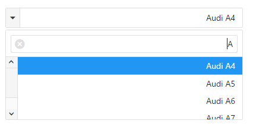
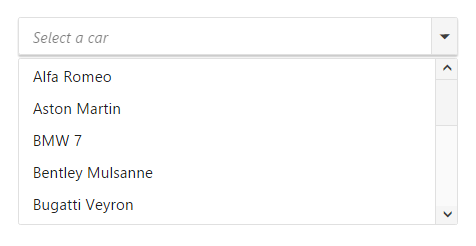

# Getting Started with JSP DropDownList

This section briefly describes about how to create a **DropDownList** in your application with JSP.The external script dependencies of the **DropDownList** widget are,
 * jQuery 1.7.1 and later versions.
And the internal script dependencies of the **DropDownList** widget are:

<table>
	<tr>
		<th>File </th>
		<th>Description / Usage </th>
	</tr>
	<tr>
		<td>ej.core.min.js</td>
		<td>Must be referred always before using all the JS controls.</td>
	</tr>
	<tr>
		<td>ej.data.min.js</td>
		<td>Used to handle data operation and should be used while binding data to JS controls.</td>
	</tr>
	<tr>
		<td>ej.scroller.min.js</td>
		<td>Should be referred when using scrolling in DropDownList.</td>
	</tr>
	<tr>
		<td>ej.dropdownlist.min.js</td>
		<td>The dropdownlist main file</td>
	</tr>
</table>

For getting started you can use the ‘ej.web.all.min.js’ file, which encapsulates all the ‘ej’ controls and frameworks in one single file.
For themes, you can use the ‘ej.web.all.min.css’ CDN link from the snippet given. To add the themes in your application, please refer this link.

## Create a simple DropDownList in JSP

You can create an JSP application and add necessary scripts with the help of the given [JSP Getting Started Documentation.](/jsp-docs/jsp/Getting-Started).

The DropDownList can be created in JSP by using the below given code.



<ej:dropDownList id="selectCar" targetID="carsList" width="100%" watermarkText="Select a car" ></ej:dropDownList>
	

        <ul>
            <li>Audi A4</li>
            <li>Audi A5</li>
            <li>Audi A6</li>
            <li>Audi A7</li>
            <li>Audi A8</li>
        </ul>
    



You can execute the above code example to display the DropDownList control.

 
## Configuring the DropDownList

This section encompasses the details on how to configure the dropdownlist component with its API properties like enableRTL, selectedIndex, enablefilterSearch.



<ej:dropDownList id="selectCar" targetID="carsList" width="100%" watermarkText="Select a car"  selectedIndex="2" enableRTL="true" enableFilterSearch="true" ></ej:dropDownList>
	

        <ul>
            <li>Audi A4</li>
            <li>Audi A5</li>
            <li>Audi A6</li>
            <li>Audi A7</li>
            <li>Audi A8</li>
        </ul>
    


	
Run the above code to get the following output.
 

## Populating Data

The data for **DropDownList** which can be populated using the dataSource property.
To configure data for DropDownList component, define an object array data. You need to import datasource in JSP sample and access the data in datasource by creating object of it. Refer the below code to define the datasource for the DropDownList.



**Package** datasource; 

**import** java.util.ArrayList; 

**public** **class** GetCarDataSource { 

ArrayList<CarDataSource> data= **new** ArrayList<CarDataSource>(); 

**public** ArrayList<CarDataSource> getData1(){

data.add(**new** CarDataSource("Audi S6 ")); 
data.add(**new** CarDataSource("Aston Martin"));
data.add(**new** CarDataSource("Alfa Romeo")); 
data.add(**new** CarDataSource("Aston Martin")); 
data.add(**new** CarDataSource("BMW 7")); 
data.add(**new** CarDataSource("Bentley Mulsanne")); 
data.add(**new** CarDataSource("Bugatti Veyron")); 
data.add(**new** CarDataSource("Chevrolet Camaro")); 
data.add(**new** CarDataSource("Cadillac")); 
data.add(**new** CarDataSource("Duesenberg J")); 
data.add(**new** CarDataSource("Elantra")); 
data.add(**new** CarDataSource("Ferrari")); 
data.add(**new** CarDataSource("Honda")); 
data.add(**new** CarDataSource("Hyundai Santro")); 
data.add(**new** CarDataSource("Isuzu Swift")); 
data.add(**new** CarDataSource("Volkswagen Shirako")); 
return data; 

   } 
}



Access the data from datasource by using below code,



<% 

GetCarDataSource obj =new GetCarDataSource(); 

Object data = obj.getData1(); 

request.setAttribute("CarDataSource", data); 

%>



Refer the below code to render  DropDownList with datasource.



<ej:dropDownList id="selectCar" width="100%" watermarkText="Select a car" dataSource="${CarDataSource}">
	</ej:dropDownList>

	
	
Run the above code to get the following output.

	 
## Setting Dimensions

DropDownList dimensions can be set using width and height API.



<ej:dropDownList id="selectCar" targetID="carsList" width="300px"   height=”50px”  watermarkText="Select a car" ></ej:dropDownList>
	

        <ul>
            <li>Audi A4</li>
            <li>Audi A5</li>
            <li>Audi A6</li>
            <li>Audi A7</li>
            <li>Audi A8</li>
        </ul>
    

	
	
### Setting dimensions to Popup list

PopupWidth and popupHeight can be used to create a fixed size popup list.



<ej:dropDownList id="selectCar" targetID="carsList" width="300px"   popupHeight="200px"   popupWidth="300px"  height="50px"   watermarkText="Select a car" ></ej:dropDownList>
	

        <ul>
            <li>Audi A4</li>
            <li>Audi A5</li>
            <li>Audi A6</li>
            <li>Audi A7</li>
            <li>Audi A8</li>
        </ul>
    



## Setting and Getting Value

You can select single or multiple values from DropDownList widget. 



	<ej:dropDownList id="selectCar" width="100%" watermarkText="Select a car" dataSource="${CarDataSource}" select="onSelect">
	</ej:dropDownList>
	
	



function onSelect(args){
	alert("Selected item value is " + args.value);
}



