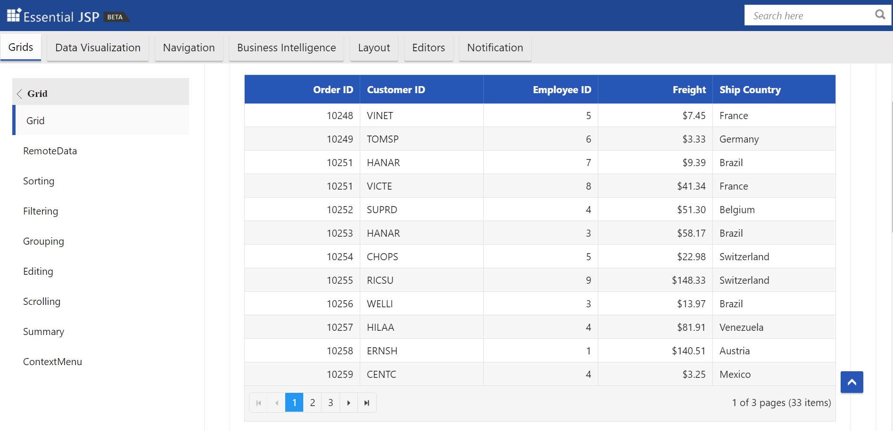
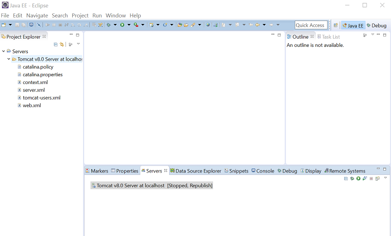
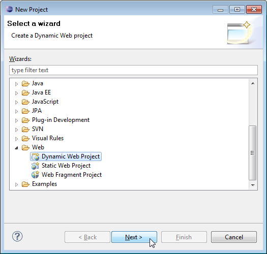
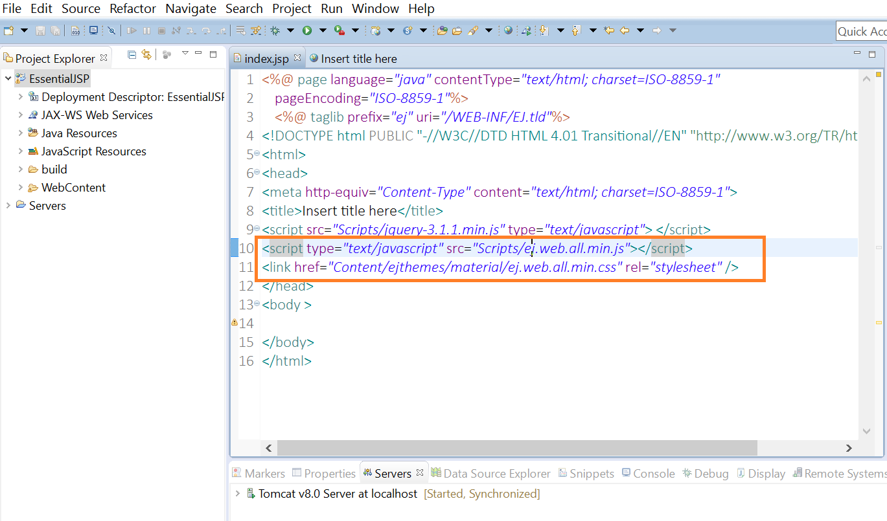
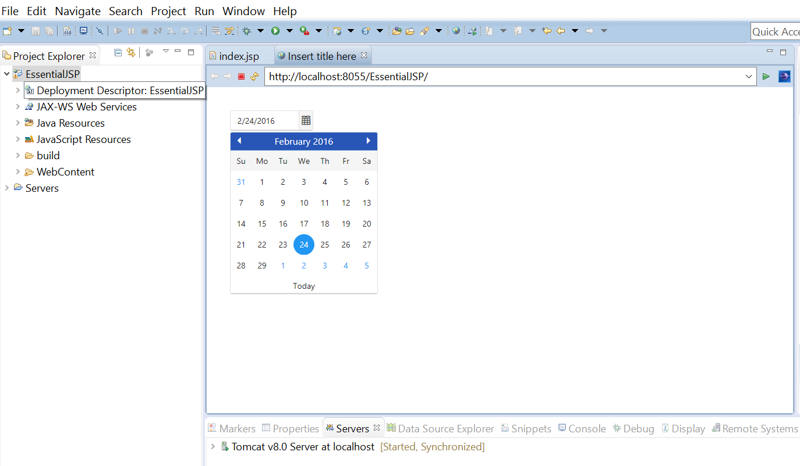

# Getting Started

## Essential JSP

### System Requirements

To work with JSP, you need to meet the below configuration. 

* Java Development Kit (JDK), Java Runtime Environment (JRE) version (1.7 or 1.8) needs to be installed and configured.
* Any web servers (Apache Tomcat 7) that’s supports the Java Servlet, JSP specification. Also, ensure that the web servers need to be tested and configured with the IDE.
* Eclipse IDE for Enterprise developers with J2EE support – (Lune, Kepler, Mars, or later) or NetBeans IDE with Java2E support.

### Download and Install 

Download and install the Essential JSP component setup from this link after logging in with your Syncfusion account. 

You can download the Essential JSP components in two ways.

* Setup file(.exe).
* Zipped file.

If you are installing the setup file (.exe), then the Essential JSP component packages will be available under the installed location of Syncfusion, refer below.

   (installed location) \Syncfusion\Essential Studio\14.4.0.15\JSP\.

You can also find the JSP samples (demo website) available under the below installed location.

  (installed location) \Syncfusion\Essential Studio\14.4.0.15\JSP\Samples\.

If you are downloading the zipped package, Downloaded package contains the following directories.

1.	/Src - Comprises of Essential JSP source package (jar files) to use Essential JSP.
2.	/Samples - Sample JSP Web Site.
3.	/Scripts - Contains necessary widget scripts as well as culture scripts for Syncfusion Essential JSP components. Also, contains external dependency files such as jQuery, jsRender etc.
4.	/Themes - Contains the style sheets for web components

### Steps to deploy the Essential JSP component demos in Apache Tomcat 

1.	Download the Apache Tomcat from the official download page
2.	You can find a sample JSP web site in the /Samples directory of the Essential JSP distribution. To run the web site, copy this directory to your Webapps folder of Apache Tomcat
3.	Run the startup.bat file from the Tomcat location (Tomcat bin folder)
4.	JSP SampleBrowser will be launched under the default port 8080 (localhost: 8080/SampleBrowser/index.jsp).
5.	Browse product samples using the Sample Browser.

### Steps to utilize Essential JSP components in Dynamic web application with Eclipse environment

To use Essential JSP in eclipse environment, follow the steps below:

1. Eclipse IDE with Apache Tomcat 7 configured 

  

2. Create a Dynamic web application in eclipse

   *	Choose File > New > Project....
   *	In the upcoming wizard choose Web > Dynamic Web Project.
   

  And create a new Dynamic web project in eclipse.

3. Add a new JSP page to your project’s.
   *	Right-click the WebContent folder. 
   *	Select New > JSP file. 
   *	Enter a file name and click Finish.

4. Copy Essential JavaScript and CSS files from /SampleBrowser/Scripts and /SampleBrowser/Content to your project’s /WebContent and Configure your JSP page to include the Essential JavaScript and CSS files to the page, as shown in the example below.

    <b>Example</b>

    

    <head>

    <link href="Content/ejthemes/material/ej.web.all.min.css" rel="stylesheet" />

    

    </head>

    

    

5. Now add the Essential JSP source package from \SampleBrowser\WEB-INF\lib\syncfusion-taglib-[version].jar to your project's /WebContent/WEB-INF/lib folder.

6. Add the Custom taglib from \SampleBrowser\WEB-INF\EJ.tld to your project’s /WebContent/WEB-INF.
 
7. Import the Essential JSP component package into your JSP page.

    <b>Example</b>

    

    <%@ page import="com.syncfusion.*"%>

    

8. Add the mapping Tag Library descriptor (tld) file to support Essential JSP custom tags.

    <b>Example</b>

    

    <%@ taglib prefix="ej" uri="/WEB-INF/EJ.tld"%>

    

9. Use the Essential JSP custom tag within your JSP file.

    <b>Example</b>

    

    <ej:datePicker id="datepicker”></ej:datePicker>

    

10. Finally, right-click your project’s in the Eclipse Project Explorer.

   * Select Run As > Run on server.
  

