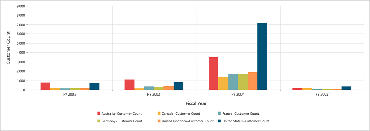

# Dimensions

## Set size in percentage

You can customize the PivotChart dimension by setting the width and height of the control in percentage.



	

		<ej:pivotChart id="PivotChart1 load="onLoad">
		//...
		</ej:pivotChart
	

	



## Set size in pixels

You can customize the PivotChart dimension by setting the width and height of the control in pixels.



	

		<ej:pivotChart id="PivotChart1" load="onLoad">
		//...
		</ej:pivotChart
	

	


 
 

## Responsive

PivotChart control supports responsive rendering based on the target device (desktop & tablet) resolution. It supports resolution upto 1024x600. You can enable responsiveness in PivotChart by setting `isResponsive` property to true.



	

		<ej:pivotChart id="PivotChart1" isResponsive="true">
		//...
		</ej:pivotChart
	



_Normal View_

_ResponsiveView_

