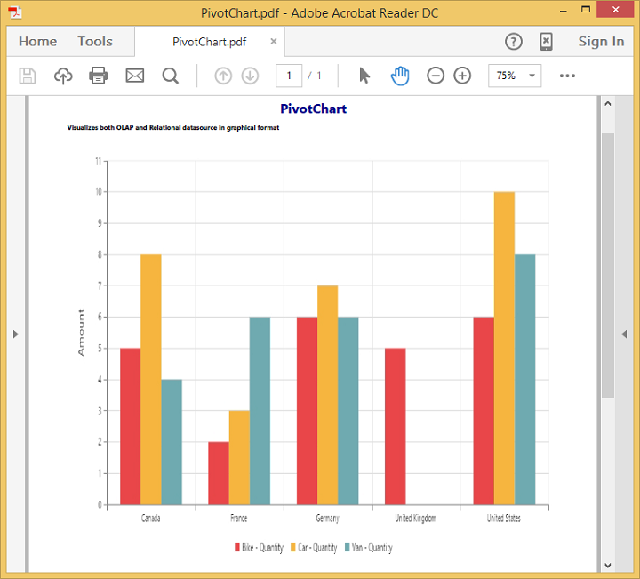
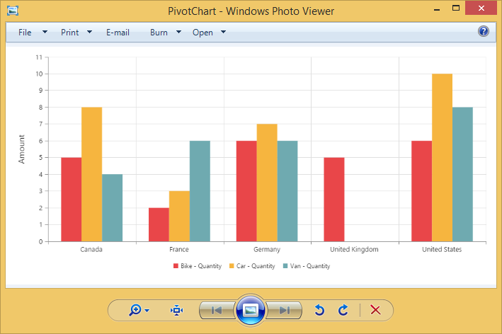

# Exporting

The PivotChart control can be exported to the following file formats.

* Excel
* Word
* PDF
* Image

The PivotChart control can be exported by invoking **“exportPivotChart”** method, with an appropriate export option as parameter.

## Excel Export

User can export contents of the PivotChart to Excel document for future archival, references and analysis purposes.

To achieve Excel export, method name **"ExcelExport"** and file name is sent as the parameter.



	

		<ej:pivotChart id="PivotChart1>
		//...
		</ej:pivotChart
	

    

        <ej:button id="button" text="Export" size="large" showRoundedCorner="true" click="exportButtonClick"></ej:button>
    

    
	



## Word Export
User can export contents of the PivotChart to Word document for future archival, references and analysis purposes.

To achieve Word export, method name **"WordExport"** and file name is sent as the parameter.



	

		<ej:pivotChart id="PivotChart1>
		//...
		</ej:pivotChart
	

    

        <ej:button id="button" text="Export" size="large" showRoundedCorner="true" click="exportButtonClick"></ej:button>
    

    
	



## PDF Export

User can export contents of the PivotChart to PDF document for future archival, references and analysis purposes.

To achieve Word export, method name **"PDFExport"** and file name is sent as the parameter.



	

		<ej:pivotChart id="PivotChart1>
		//...
		</ej:pivotChart
	

    

        <ej:button id="button" text="Export" size="large" showRoundedCorner="true" click="exportButtonClick"></ej:button>
    

    
	



## Image Export
User can export contents of the PivotChart to image format for future archival, references and analysis purposes. We can export PivotChart to the following image formats.

* PNG
* EMF
* JPG
* GIF
* BMP

To achieve image export, method name **"ImageExport"** ,**“ej.PivotChart.ExportOptions.PNG”** and file name is sent as the parameter.This is similar to other image formats.



	

		<ej:pivotChart id="PivotChart1>
		//...
		</ej:pivotChart
	

    

        <ej:button id="button" text="Export" size="large" showRoundedCorner="true" click="exportButtonClick"></ej:button>
    

    
	



## PivotChart format selection

I> This option is applicable only for PivotChart specifically when exported to Excel document.

You can set an option to export PivotChart to an Excel document, either as image or PivotChart format itself by setting the boolean property `exportChartAsImage`, inside the `beforeExport` event.

N> By default PivotChart will be exported as image format to Excel document.



	

		<ej:pivotChart id="PivotChart1 beforeExport="BeforeExport">
		//...
		</ej:pivotChart
	

    

        <ej:button id="button" text="Export" size="large" showRoundedCorner="true" click="exportButtonClick"></ej:button>
    

    
	



The below screenshot shows the control exported to Excel document showing its own format (Pivoting Chart).

## Exporting Customization

You can add title and description to the exporting document by using title and description property obtained in the "beforeExport" event.

N> Title and description cannot be added to image formats.



	

		<ej:pivotChart id="PivotChart1 beforeExport="BeforeExport">
		//...
		</ej:pivotChart
	

    

        <ej:button id="button" text="Export" size="large" showRoundedCorner="true" click="exportButtonClick"></ej:button>
    

    
	



The name of the document can be customized as per the users requirement.

We need to send file name as parameter to the **“exportPivotChart”**  method along with service URL.



function exportButtonClick(args)
{
    var chartObj = $('#PivotChart1').data("ejPivotChart ");
    chartObj.exportPivotChart("http://js.syncfusion.com/ejservices/api/PivotChart/Olap/ExcelExport", "fileName");
}
    

The below screenshot shows the PivotChart control exported to Excel document.

The below screenshot shows the PivotChart control exported to PDF document.

The below screenshot shows the PivotChart control exported to Word document.

The below screenshot shows the PivotChart control exported to PNG format.

