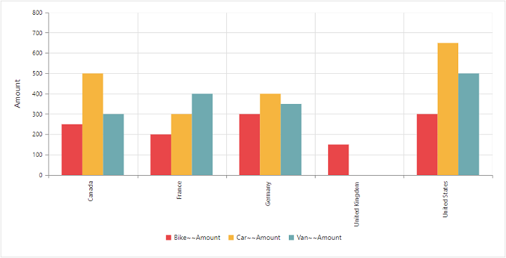
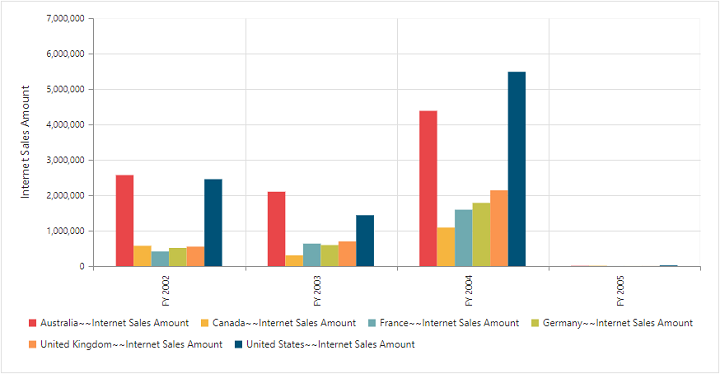

# Getting Started

This section explains you the steps required to populate the PivotChart in your application with **JSP** wrapper classes of EJ controls. This section covers only the minimal features that you need to know to get started with the PivotChart.

## Create PivotChart widget

You can create a JSP Project and add necessary scripts and styles with the help of the given JSP Getting Started Documentation.

Create a first JSP file in Xampp and name it appropriately with `.jsp` extension and also place it under the newly created sample folder. For example, say Index.jsp with the initial code as shown below -

Refer the required scripts and CSS files in your JSP page as mentioned below in order to render the PivotChart control - 



	<!DOCTYPE html>
	<html>
		<head>
			<title>Getting Started - PivotChart</title>
			<link href="http://cdn.syncfusion.com/{{ site.releaseversion }}/js/web/flat-azure/ej.web.all.min.css" rel="stylesheet" />
			<link href="http://cdn.syncfusion.com/{{ site.releaseversion }}/js/web/responsive-css/ej.responsive.css" rel="stylesheet" />
			
			
			
		</head>
	</html>



## Relational

Add the following code example to add list of items to the **PivotChart** and initialize the **PivotChart** widget with Relational data source.



	

	<ej:pivotChart id="PivotChart1" isResponsive="true" load="onLoad">
	<ej:pivotChart-dataSource>
	<ej:pivotChart-dataSource-rows>
	<ej:pivotChart-dataSource-row fieldName="Country" fieldCaption="Country"></ej:pivotChart-dataSource-row>
	</ej:pivotChart-dataSource-rows>
	<ej:pivotChart-dataSource-columns>
	<ej:pivotChart-dataSource-column fieldName="Product" fieldCaption="Product"></ej:pivotChart-dataSource-column>
	</ej:pivotChart-dataSource-columns>
	<ej:pivotChart-dataSource-values>
	<ej:pivotChart-dataSource-value fieldName="Amount" fieldCaption="Amount"></ej:pivotChart-dataSource-value>
	</ej:pivotChart-dataSource-values>
	</ej:pivotChart-dataSource>
	<ej:pivotChart-commonSeriesOptions type="column"></ej:pivotChart-commonSeriesOptions>
	</ej:pivotChart>
	

	



The above code will generate a simple PivotChart with sales amount over products in different regions.

## OLAP

Add the following code example to add list of items to the **PivotChart** and initialize the **PivotChart** widget with OLAP data source.



	

	<ej:pivotChart id="PivotChart1" isResponsive="true" load="onLoad">
	<ej:pivotChart-dataSource data="//bi.syncfusion.com/olap/msmdpump.dll" catalog="Adventure Works DW 2008 SE" cube="Adventure Works">
	<ej:pivotChart-dataSource-rows>
	<ej:pivotChart-dataSource-row fieldName="[Date].[Fiscal]"></ej:pivotChart-dataSource-row>
	</ej:pivotChart-dataSource-rows>
	<ej:pivotChart-dataSource-columns>
	<ej:pivotChart-dataSource-column fieldName="[Customer].[Customer Geography]"></ej:pivotChart-dataSource-column>
	</ej:pivotChart-dataSource-columns>
	<ej:pivotChart-dataSource-values>
	<ej:pivotChart-dataSource-value axis="columns">
	<ej:pivotChart-dataSource-value-measures>
	<ej:pivotChart-dataSource-value-measure fieldName="[Measures].[Internet Sales Amount]"></ej:pivotChart-dataSource-value-measure>
	</ej:pivotChart-dataSource-value-measures>
	</ej:pivotChart-dataSource-value>
	</ej:pivotChart-dataSource-values>
	</ej:pivotChart-dataSource>
	<ej:pivotChart-commonSeriesOptions type="column"></ej:pivotChart-commonSeriesOptions>
	</ej:pivotChart>
	

	



The above code will generate a simple PivotChart with internet sales amount over a period of fiscal years across different customer geographic locations.

