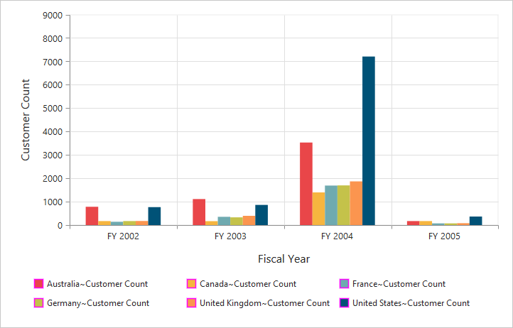

# Legend

## Legend Visibility

You can enable or disable legend using the `visible` property inside the `legend` object.

N> By default, the legend is visible in PivotChart.



	

		<ej:pivotChart id="PivotChart1 load="onLoad">
		//...
		</ej:pivotChart
	

	



 

## Legend Shape
You can customize the legend `shape` in PivotChart control. Default value of legend shape is “Rectangle”. Following legend shapes that are supported:

* Rectangle
* Circle
* Cross
* Diamond
* Pentagon
* Hexagon
* Star
* Ellipse
* Triangle etc.



	

		<ej:pivotChart id="PivotChart1 load="onLoad">
		//...
		</ej:pivotChart
	

	



 

## Legend Position
By using the `position` property, you can place the legend at top, bottom, left or right of the PivotChart. 

N> Default value of legend position is "bottom" in PivotChart.



	

		<ej:pivotChart id="PivotChart1 load="onLoad">
		//...
		</ej:pivotChart
	

	



 

## Legend Title
To add the legend title, you have to specify the title text in `title.text` property.



	

		<ej:pivotChart id="PivotChart1 load="onLoad">
		//...
		</ej:pivotChart
	

	



 

## Legend Alignment
You can align the legend to center, far and near based on its position in the Chart area using the `alignment` option.
 


	

		<ej:pivotChart id="PivotChart1 load="onLoad">
		//...
		</ej:pivotChart
	

	



## Legend Items - Size and Border
By using the legend `itemStyle.width`, `itemStyle.height` and `itemStyle.border` properties, you can change the legend items - size and border.



	

		<ej:pivotChart id="PivotChart1 load="onLoad">
		//...
		</ej:pivotChart
	

	



 
## Legend Border
By using the `border` option in legend, you can customize border color and width.



	

		<ej:pivotChart id="PivotChart1 load="onLoad">
		//...
		</ej:pivotChart
	

	



## Legend Text
By using the `font` option, you can customize the font family, font style, font weight and size of the legend text. 



	

		<ej:pivotChart id="PivotChart1 load="onLoad">
		//...
		</ej:pivotChart
	

	



