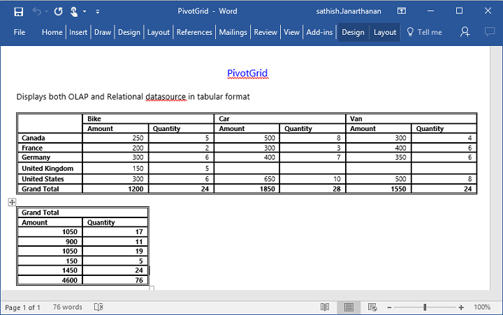

# Exporting

The PivotGrid control can be exported to the following file formats.

* Excel
* Word
* PDF
* CSV

The PivotGrid control can be exported by invoking **“exportPivotGrid”** method, with an appropriate export option as parameter.

## JSON Export

### Excel Export

User can export the contents of PivotGrid to an Excel document for future archival, references and analysis purposes.

To achieve Excel export, URL and file name is sent as the parameter.



	

		<ej:pivotGrid id="PivotGrid1">
		//...
		</ej:pivotGrid
	

    

        <ej:button id="button" click="exportButtonClick" showRoundedCorner="true" size="large" text="Export"></ej:button> 
    

    
	

 

### Word Export

User can export the contents of PivotGrid to a Word document for future archival, references and analysis purposes.

To achieve Word export, URL and file name is sent as the parameter.



	

		<ej:pivotGrid id="PivotGrid1">
		//...
		</ej:pivotGrid
	

    

        <ej:button id="button" click="exportButtonClick" showRoundedCorner="true" size="large" text="Export"></ej:button> 
    

    
	

 

### PDF Export

User can export the contents of PivotGrid to a PDF document for future archival, references and analysis purposes.

To achieve Word export, URL and file name is sent as the parameter.



	

		<ej:pivotGrid id="PivotGrid1">
		//...
		</ej:pivotGrid
	

    

        <ej:button id="button" click="exportButtonClick" showRoundedCorner="true" size="large" text="Export"></ej:button> 
    

    
	

 

### CSV Export

User can export the contents of PivotGrid to a CSV document for future archival, references and analysis purposes.

To achieve CSV export, URL and file name is sent as the parameter.



	

		<ej:pivotGrid id="PivotGrid1">
		//...
		</ej:pivotGrid
	

    

        <ej:button id="button" click="exportButtonClick" showRoundedCorner="true" size="large" text="Export"></ej:button> 
    

    
	

 

### Customize the export document name

For customizing file name, we need to send file name as parameter to the **“exportPivotGrid”**  method along with method name.



	

		<ej:pivotGrid id="PivotGrid1">
		//...
		</ej:pivotGrid
	

    

        <ej:button id="button" click="exportButtonClick" showRoundedCorner="true" size="large" text="Export"></ej:button> 
    

    
	

 

## Exporting Customization

You can add title and description to the exporting document by using the title and description properties respectively obtained in the `beforeExport` event. Similarly, you can enable or disable styling on the exported document by using the `exportWithStyle` property.



	

		<ej:pivotGrid id="PivotGrid1" beforeExport="BeforeExport">
		//...
		</ej:pivotGrid
	

    

        <ej:button id="button" click="exportButtonClick" showRoundedCorner="true" size="large" text="Export"></ej:button> 
    

    
	

 

### Exporting complete data on Paging

When paging is enabled, you can export the complete data by enabling the `enableCompleteDataExport` property. It is supported in both types of JSON and PivotEngine export and it is applicable for all kinds of exporting formats available in PivotGrid.



	

		<ej:pivotGrid id="PivotGrid1" beforeExport="BeforeExport" enableCompleteDataExport="true">
		//...
		</ej:pivotGrid
	

    

        <ej:button id="button" click="exportButtonClick" showRoundedCorner="true" size="large" text="Export"></ej:button> 
    

    
	



The below screenshot shows the PivotGrid control exported to Excel document.

The below screenshot shows the PivotGrid control exported to Word document.

The below screenshot shows the PivotGrid control exported to PDF document.

The below screenshot shows the PivotGrid control exported to CSV document.

