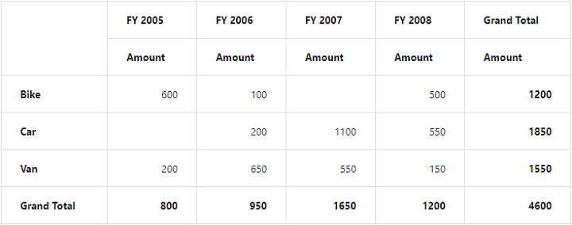

# Getting Started

This section explains you the steps required to populate the PivotGrid in your application with **JSP** wrapper classes of EJ controls. This section covers only the minimal features that you need to know to get started with the PivotGrid.

## Create PivotGrid widget

You can create a JSP Project and add necessary scripts and styles with the help of the given JSP Getting Started Documentation.

Create a first JSP file in Xampp and name it appropriately with `.jsp` extension and also place it under the newly created sample folder. For example, say Index.jsp with the initial code as shown below -

Refer the required scripts and CSS files in your JSP page as mentioned below in order to render the PivotGrid control - 



<!DOCTYPE html>
<html>
	<head>
			<title>Getting Started - PivotGrid</title>
			<link href="http://cdn.syncfusion.com/{{ site.releaseversion }}/js/web/flat-azure/ej.web.all.min.css" rel="stylesheet" />
			<link href="http://cdn.syncfusion.com/{{ site.releaseversion }}/js/web/responsive-css/ej.responsive.css" rel="stylesheet" />
			
			
			
	</head>
</html>



## Relational

Add the following code example to add list of items to the **PivotGrid** and initialize the **PivotGrid** widget with Relational data source.



<ej:pivotGrid id="PivotGrid1" load="onLoad">
<ej:pivotGrid-dataSource>
<ej:pivotGrid-dataSource-rows>
<ej:pivotGrid-dataSource-row fieldName="Product" fieldCaption="Product"></ej:pivotGrid-dataSource-row>
</ej:pivotGrid-dataSource-rows>
<ej:pivotGrid-dataSource-columns>
<ej:pivotGrid-dataSource-column fieldName="Date" fieldCaption="Date"></ej:pivotGrid-dataSource-column>
</ej:pivotGrid-dataSource-columns>
<ej:pivotGrid-dataSource-values>
<ej:pivotGrid-dataSource-value fieldName="Amount" fieldCaption="Amount"></ej:pivotGrid-dataSource-value>
</ej:pivotGrid-dataSource-values>
</ej:pivotGrid-dataSource>
</ej:pivotGrid>



The above code will generate a simple PivotGrid with “Product” field in Row, “Date” field in Column and “Amount” field in Value section.

## OLAP

Add the following code example to add list of items to the **PivotGrid** and initialize the **PivotGrid** widget with OLAP data source.



<ej:pivotGrid id="PivotGrid1">
<ej:pivotGrid-dataSource catalog="Adventure Works DW 2008 SE" cube="Adventure Works" data="//bi.syncfusion.com/olap/msmdpump.dll">
<ej:pivotGrid-dataSource-rows>
<ej:pivotGrid-dataSource-row fieldName="[Date].[Fiscal]"></ej:pivotGrid-dataSource-row>
</ej:pivotGrid-dataSource-rows>
<ej:pivotGrid-dataSource-columns>
<ej:pivotGrid-dataSource-column fieldName="[Customer].[Customer Geography]"></ej:pivotGrid-dataSource-column>
</ej:pivotGrid-dataSource-columns>
<ej:pivotGrid-dataSource-values>
<ej:pivotGrid-dataSource-value axis="columns">
<ej:pivotGrid-dataSource-value-measures>
<ej:pivotGrid-dataSource-value-measure fieldName="[Measures].[Internet Sales Amount]"></ej:pivotGrid-dataSource-value-measure>
</ej:pivotGrid-dataSource-value-measures>
</ej:pivotGrid-dataSource-value></ej:pivotGrid-dataSource-values>
</ej:pivotGrid-dataSource>
</ej:pivotGrid>



The above code will generate a simple PivotGrid with “Fiscal” field in Row, “Customer Geography” field in Column and “Internet Sales Amount” field in Value section.

