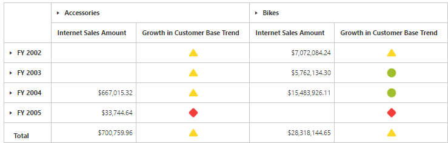

# KPI

Key Performance Indicators (KPI) are business metric that help to figure out the progress of an enterprise in meeting its business goals.

The different indicators available in KPI are:

* KPI Value: A physical measure or a calculated measure.
* KPI Goal: Defines the target for the measure.
* KPI Status: Evaluates the current status of the value compared to the goal. 
* KPI Trend: Evaluate the current trend of the value compared to the goal.

The **"KpiElements"** class in OLAP Base library holds the KPI name and when its object is added to an OlapReport, you can view the resultant information in PivotGrid.



<ej:pivotGrid id="PivotGrid1">
<ej:pivotGrid-dataSource catalog="Adventure Works DW 2008 SE" cube="Adventure Works" data="//bi.syncfusion.com/olap/msmdpump.dll">
<ej:pivotGrid-dataSource-rows>
<ej:pivotGrid-dataSource-row fieldName="[Date].[Fiscal]"></ej:pivotGrid-dataSource-row>
</ej:pivotGrid-dataSource-rows>
<ej:pivotGrid-dataSource-columns>
<ej:pivotGrid-dataSource-column fieldName="[Product].[Product Categories]"></ej:pivotGrid-dataSource-column>
</ej:pivotGrid-dataSource-columns>
<ej:pivotGrid-dataSource-values>
<ej:pivotGrid-dataSource-value axis="columns">
<ej:pivotGrid-dataSource-value-measures>
<ej:pivotGrid-dataSource-value-measure fieldName="[Measures].[Internet Sales Amount]"></ej:pivotGrid-dataSource-value-measure>
<ej:pivotGrid-dataSource-value-measure fieldName="[Measures].[Growth in Customer Base Trend]"></ej:pivotGrid-dataSource-value-measure>
</ej:pivotGrid-dataSource-value-measures>
</ej:pivotGrid-dataSource-value></ej:pivotGrid-dataSource-values>
</ej:pivotGrid-dataSource>
</ej:pivotGrid>



