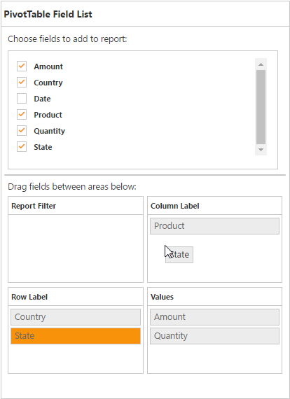
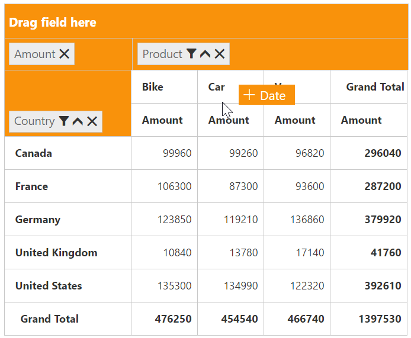
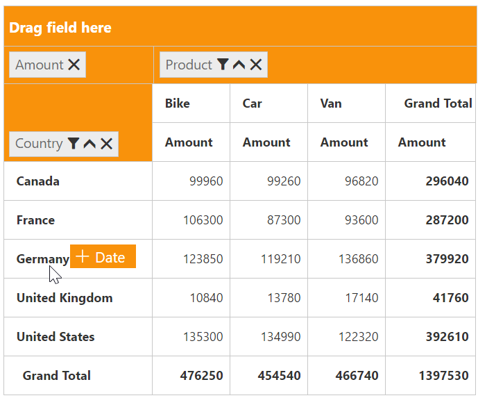
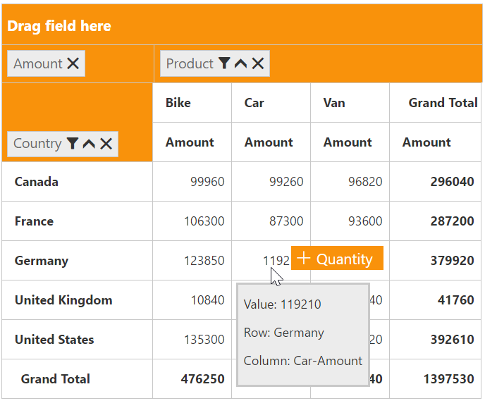
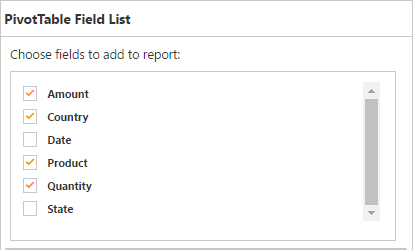
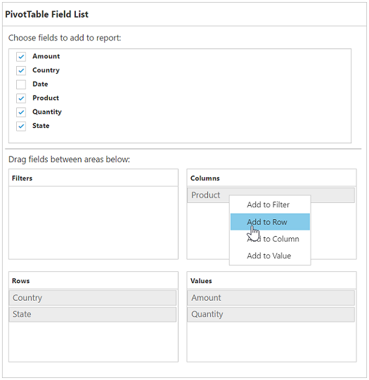
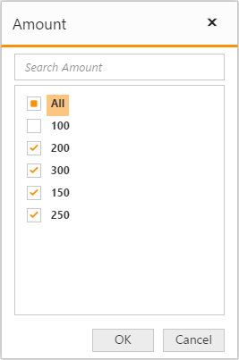

# Pivot table field list

## Initialization  

The field list, also known as pivot schema designer, allows you to add, rearrange, filter, and remove fields to show data in the pivot grid exactly the way you desire.

Based on the data source and relational binding to the pivot grid control, the pivot table field list will be automatically populated with cube information or field names. This list provides an Excel like appearance and behavior.

You should initialize the pivot table field list by using the **"PivotSchemaDesigner"** tag.



<ej:pivotGrid id="PivotGrid1" pivotTableFieldListID="PivotSchemaDesigner">
	//...
</ej:pivotGrid>
<ej:pivotSchemaDesigner id="PivotSchemaDesigner"></ej:pivotSchemaDesigner>

 

## Layout

The top portion of the layout shows field or cube items in a categorized way. They can be dynamically added to the report by drag and drop option or through simple check box selection.
 
Item(s) selected will be placed in the row section by default, except numeric based item(s) or measures, which will be placed in the value section, by default.

The bottom portion of the layout is segregated as follows:

* Report filter: Filters item(s) placed in a particular position of the layout. 
* Value section: The value label usually displays the numeric value item(s) present in the report.
* Column section: Displays item(s) as column header and values in the pivot grid control.
* Row section: Displays item(s) as row header and values in the pivot grid control.
 
## UI interactions

### By drag and drop

You can alter the report on fly through the drag and drop operation. You can drag any item from the field list and drop it in the column, row, value, or filter section available at the bottom of the field list.

### By drag and drop to grid headers

You can also drag and drop elements from the field list to grid headers.

### By tree view selection

You can alter the report on fly through the check and uncheck option as an alternate. By default, fields will be added to the row axis when checked.

 ### By context menu
 
You can also alter the report by using the context menu.

## Searching values
The search option available in the field list allows you to search a specific value that should be filtered from the list of values in the filter pop-up window.

## Filtering
Values can be filtered by checking/unchecking the check box beside them in the filter pop-up window. At least, one value should present in checked state while filtering, otherwise, the OK button will be disabled.

