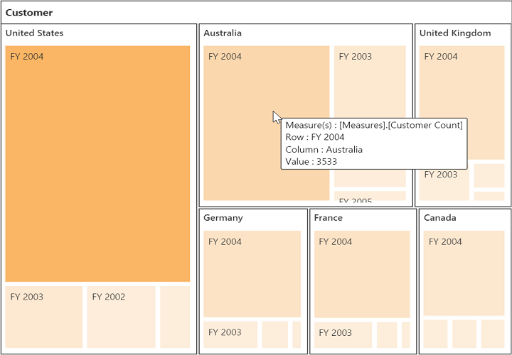

#Legend

##Legend Visibility

The legend shows the value range differences and color occurrence in the respective leaf node while you hover it with the cursor.

N> By default, the legend is visible in PivotTreeMap.

You can disable the legend by setting the property **showLegend** as **false**. The following code example shows how to disable the legend.



<ej:pivotTreeMap id="PivotTreeMap1" renderSuccess="RenderSuccess">
//...
</ej:pivotTreeMap>

