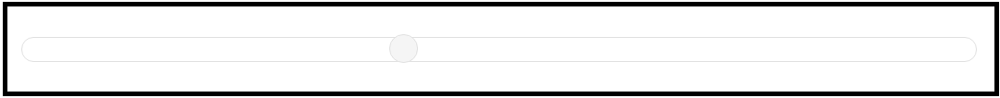

# Getting Started with JSP Slider

This section explains briefly about how to create a **Slider** in your application with JSP.

The usage of **Slider** control is described in the following sections.

## Create a Slider in JSP
You can create an JSP application and add necessary scripts with the help of the given [JSP Getting Started Documentation](https://help.syncfusion.com/jsp/getting-started).

Create the JSP file and add the below given code to render **Slider** control with **value** property.



     <ej:slider id="slider" value="40"></ej:slider>
      


You can execute the above code example to display the **Slider** control.

 

