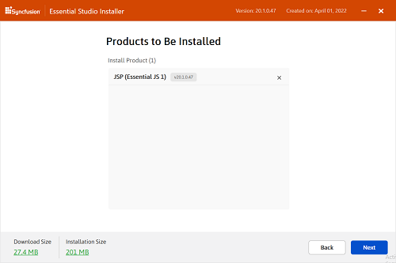
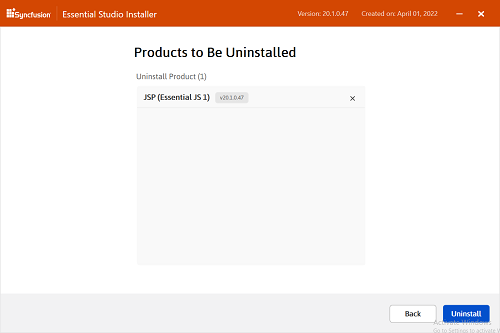
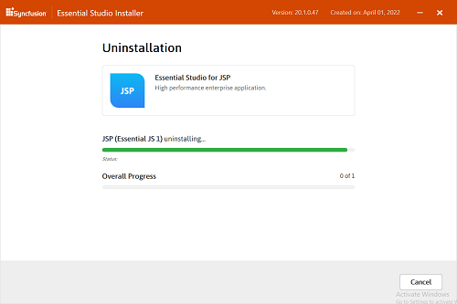
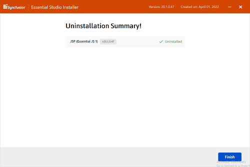
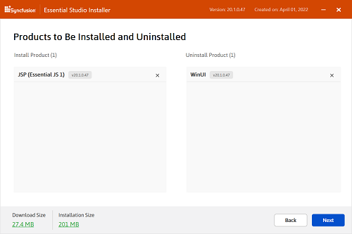
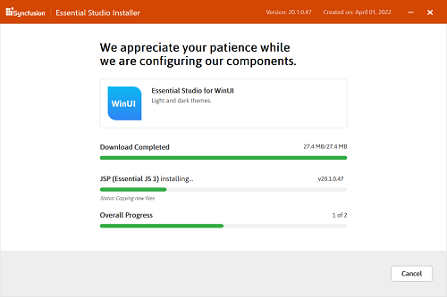
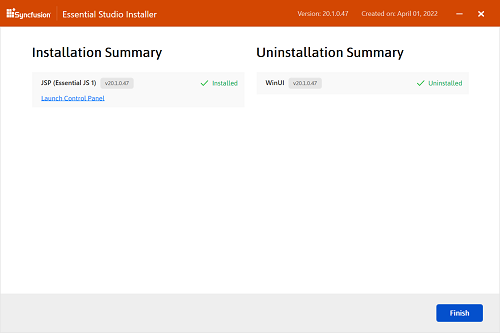

## Installation

The following procedure illustrates how to install Essential Studio JSP Online Installer setup. 

1.  Double-click the Syncfusion Essential Studio JSP Online Installer setup file. The Setup Wizard opens and extracts the package automatically.

    

    
    N> The Setup wizard extracts the syncfusion{platform}webinstaller_{version}.exe dialog, displaying the unzip operation of the package.
    
2. Welcome wizard of the Syncfusion JSP Online Installer will be displayed. Click Next.

   

  
3.  Platform Selection wizard will be displayed. Select the platforms to be installed from the **Available** tab. Select **Install All** checkbox to select all the platforms. Click Next.
    
	
	
	I> If the required software of the selected platform was not already installed, **Additional Software Required** alert will be displayed. However, you can continue the installation and install the required software later.
	
	
		
	
4. Confirmation wizard will be displayed. Here you can view and modify the list of platforms that will be installed.

    
	
	N> You can check the Estimated size of the Download and Installation by clicking the **Download Size and Installation Size** link.
	
	

5.  Configuration wizard will be displayed. Here you can change the Download, Install and samples location. Also, you can change the Additional settings by platform basis. To install using the default configuration, click Next.

    
	
	I> From version 17.3 (2019 Vol 3), Syncfusion provides option to provide custom download location.
	
 
    N> From the 2018 Volume 2 release, Syncfusion has changed the install and samples location 
	   **Default Install location:** {ProgramFilesFolder}\Syncfusion\{Platform}\{version}
	   **Default Samples location:** C:\Users\Public\Documents\Syncfusion\{platform}\{version}
	   However, you can change the locations by clicking browse button.

	

    * Select the **Install Demos** check box to install Syncfusion samples, or leave the check box clear, when you do not want to install Syncfusion samples.
    * Select the **Create Desktop Shortcut** checkbox to create the desktop shortcut for Syncfusion Control Panel.

6.  After reading the License Terms and Conditions, check the **I agree to the License Terms and Privacy Policy** check box. Click Next.

7. Login wizard will be displayed. You should enter your Syncfusion Direct-Trac login credentials. If you don't have Syncfusion Direct-Trac login credentials, then you can click on **Create an Account**. Else if you forgot your password, click on **Forgot Password** to create new password. Click Install. 

    
	
	I> The selected platforms will be installed based on your Syncfusion License (Trial or Licensed).

8. Download and Installation progress will be displayed.

    

9. Once the Installation is complete, **Summary** wizard will be displayed. Here you can check the list of platforms which are installed successfully and failed. Click Finish to exit the Summary wizard. 

    
	
	* Click **Launch Control Panel** to open the Syncfusion Control Panel.

## Uninstallation

Till version 17.2, Syncfusion Web Installer had option for installation alone. Starting with the version 17.3 (2019 Vol 3), Syncfusion provides option for uninstalling the platforms of the same version from the Web Installer application itself. Select the list of the platforms to be uninstalled and Web Installer will uninstall those platforms one by one.

The following procedure illustrates how to uninstall Essential Studio JSP from Web Installer setup. 

1.  Double-click the Syncfusion Essential Studio JSP Online Installer setup file. The Setup Wizard opens and extracts the package automatically.

    
	
2. Welcome wizard of the Syncfusion JSP Online Installer will be displayed. Click Next.

   
   
3. Platform Selection wizard will be displayed. Select the platforms to be uninstalled from the **Installed** tab. Select **Uninstall All** checkbox to select all the platforms. Click Next.
    
	
	
4. Confirmation wizard will be displayed. Here you can view and modify the list of platforms that will be uninstalled. Click Uninstall.

    
	
5. Uninstallation progress will be displayed.
  
    
	
6. Once the Uninstallation is complete, **Summary** wizard will be displayed. Here you can check the list of platforms which are uninstalled successfully and failed. Click Finish to exit the Summary wizard. 

    
	
	
## Installation and Uninstallation

Till version 17.2, Syncfusion Web Installer had option for installation alone. Starting with the version 17.3 (2019 Vol 3), Syncfusion provides option for both install and uninstall the platforms of the same version from the Web Installer application itself.

The following procedure illustrates how to install/uninstall Essential Studio JSP from Web Installer setup. 

1.  Double-click the Syncfusion Essential Studio JSP Online Installer setup file. The Setup Wizard opens and extracts the package automatically.

    
	
2. Welcome wizard of the Syncfusion JSP Online Installer will be displayed. Click Next.

   
   
3. Platform Selection wizard will be displayed. Select the platforms to be installed from the **Available** tab and platforms to be uninstalled from the **Installed** tab. Click Next.

   **Available**
	
    
	
   **Installed**
	
    
	
4. Confirmation wizard will be displayed. Here you can view and modify the list of platforms that will be installed/uninstalled.

    
	
	N> You can check the Estimated size of the Download and Installation by clicking the **Download Size and Installation Size** link.
	
	

5.  Configuration wizard will be displayed. Here you can change the Download, Install and samples location. Also, you can change the Additional settings by platform basis. To install using the default configuration, click Next.

    
	
	I> From version 17.3 (2019 Vol 3), Syncfusion provides option to provide custom download location.
	
6.  After reading the License Terms and Conditions, check the **I agree to the License Terms and Privacy Policy** check box. Click Next.

7. Login wizard will be displayed. You should enter your Syncfusion Direct-Trac login credentials. If you don't have Syncfusion Direct-Trac login credentials, then you can click on **Create an Account**. Else if you forgot your password, click on **Forgot Password** to create new password. Click Install. 

    
	
	I> The selected platforms will be installed based on your Syncfusion License (Trial or Licensed).

8. Download, Installation and Uninstallation progress will be displayed.

    

9. Once the Installation is complete, **Summary** wizard will be displayed. Here you can check the list of platforms which are **installed/uninstalled** successfully and failed. Click Finish to exit the Summary wizard. 

    
	
	* Click **Launch Control Panel** to open the Syncfusion Control Panel.

